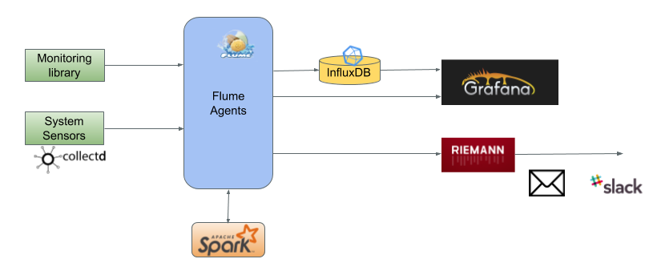
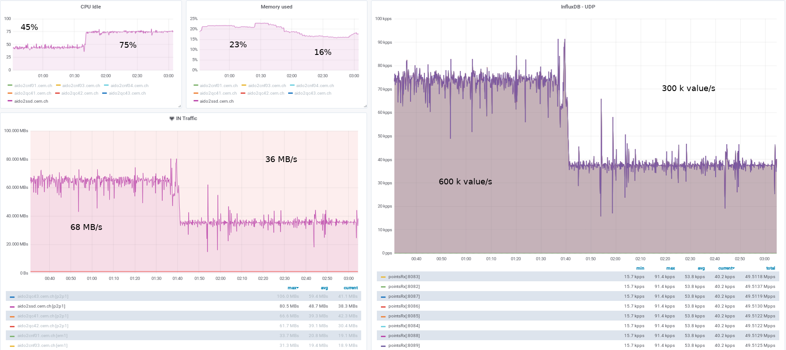
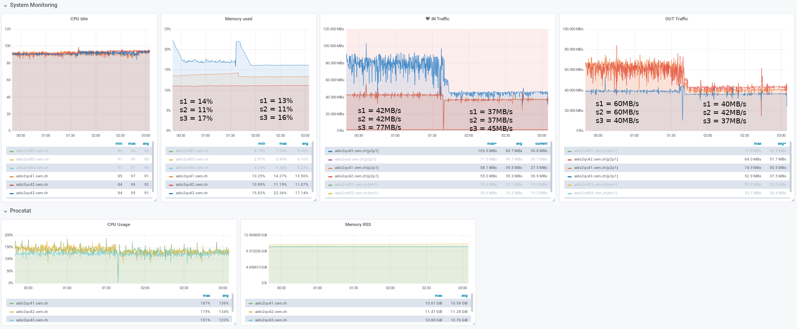

# [WIP] Monitoring system implementation based on Modular Stack

## 1. Goal

The goal of the monitoring system is to provide experts and shift crew in the ALICE Control Centre with an in-depth state of the O<sup>2</sup> computing farm. The near-real-time and historical graphical dashboards will allow users to interface easily with the large amount of monitoring data.
In order to process and supply monitoring metrics to the dashboards a set of tools were selected to meet the requirements specified in the [O<sup>2</sup> Technical Design Report](https://cds.cern.ch/record/2011297/files/ALICE-TDR-019.pdf) and  [O<sup>2</sup> Work Package 8 evaluation document](https://espace.cern.ch/alice-o2-wp8/Shared%20Documents/Monitoring/WP8-Monitoring-evaluation.pdf).

The selection criteria were approved by [O<sup>2</sup> TB in August 2017](https://indico.cern.ch/event/630547/contributions/2699553/attachments/1514045/2362116/O2-TB-Monitoring-evaluation.pdf). The WP8 [tools selection recommendation](https://indico.cern.ch/event/686148/contributions/2880669/attachments/1593253/2524202/TB-monitoring-evaluation.pdf) was approved by O<sup>2</sup> TB in February 2018.

In 2019, it was decided to replace [CollectD with Telegraf](https://indico.cern.ch/event/689265/contributions/3244748/attachments/1769050/2873555/WP8_Meeting_2018_12_11_MontoringSystem_CurrentStatus_2.pdf) and [Flume and Spark with Kafka](https://indico.cern.ch/event/797462/contributions/3313482/attachments/1798490/2932686/WP8_Meeting_2019_01_MontoringSystem_CurrentStatus.pdf).

## 2. Functional architecture

Figure 1 shows the functional architecture of the system. Three monitoring data sources were identified: Applications, Process, System related.


<p align="center">Figure 1. Monitoring architecture</p>

These data sources send the monitoring data periodically to the server-side processing and aggregation task which can perform stream or batch operations such as: Suppression, Enrichment, Correlation, Custom aggregation and others.

Afterwards data are forwarded to both storage and real-time dashboard. The storage supports high input metric rate, low storage size and downsampling. The near-real-time dashboard receives selected, processed metrics as soon as it is possible in order to allow experts to react to abnormal situations. This imposes a need of low latency transport protocol.
The historical dashboard displays data from the storage. As it has access to a larger variety of metrics it is mostly used by experts in order to drill down the issues and access detailed views.
These dashboards display data as time series plots, gauges, bar, and other graphical objects. They allow access from various operating systems and from outside of the experimental area (Point 2).
Eventually, the alarming component detects abnormal situations and notifies the experts by email, text messages or other means of notifications to quickly reaching them.

## 3. The Modular Stack
The Modular Stack solution aims at fulfilling the requirements specified in the Section 1 by using multiple tools. Such approach enables the possibility of replacing one or more of the selected components in case alternative options provide improved performance or additional functionalities.
This section gives an overview of Modular Stack components, see Figure 2, while the detailed description can be found in the following chapters.



<p align="center">Figure 2. Modular Stack architecture</p>


The O<sup>2</sup> Modular Stack collects three classes of metrics (as defined in Section 2) with assistance of the [O<sup>2</sup> Monitoring library](http://github.com/AliceO2Group/Monitoring) (Application and process metrics)
and [Telegraf](https://docs.influxdata.com/telegraf/) (System metrics). Telegraf deploys system sensors to collect metrics related to CPU, memory and I/O from all O<sup>2</sup> nodes. The core component (Apache Kafka) ensures high throughput, data pipelines and fault-tolerant services  in order to collect, route and process metrics. [InfluxDB](https://docs.influxdata.com/influxdb/v1.5/), "a custom high-performance data store written specifically for time series data", was selected as a storage backend. [Grafana](https://grafana.com/) provides graphical interfaces to display near real-time and historical metrics.

### 3.1 Monitoring library - application and process performance metrics

The [O<sup>2</sup> Monitoring library](https://github.com/AliceO2Group/Monitoring) is an entry point for the O<sup>2</sup> processes to the Monitoring subsystem. It forwards user defined and [process performance](https://github.com/AliceO2Group/Monitoring/blob/dev/README.md#monitoring-process) metrics to one of the [supported backends](https://github.com/AliceO2Group/Monitoring/blob/dev/README.md#monitoring-instance). It also allows to calculate [derived metrics](https://github.com/AliceO2Group/Monitoring/blob/dev/README.md#calculating-derived-metrics) (eg. rate) and supports [metric buffering](https://github.com/AliceO2Group/Monitoring/blob/dev/README.md#buffering-metrics) in order to improve the efficiency metric transport and decrease number context switches.

The detailed description of the library in available in the [README](https://github.com/AliceO2Group/Monitoring/blob/dev/README.md) file.

### 3.2 Telegraf - system sensors

Telegraf provides system sensors and it uses custom plugins to scrape metrics from various O<sup>2</sup> services and hardware (like CRU, CCDB). It also acts as local collector - it receives metrics from all monitoring library instances on a given host over Unix socket and forwards them to Kafka in batches.

#### 3.2.1 System sensors
The following plugins were selected in order to provide system overview of each node:
- [cpu](https://github.com/influxdata/telegraf/tree/master/plugins/inputs/cpu)
- [mem](https://github.com/influxdata/telegraf/tree/master/plugins/inputs/mem)
- [net](https://github.com/influxdata/telegraf/blob/master/plugins/inputs/net/NET_README.md)
- [system](https://github.com/influxdata/telegraf/tree/master/plugins/inputs/system)
- [kernel](https://github.com/influxdata/telegraf/tree/master/plugins/inputs/kernel)
- [disk](https://github.com/influxdata/telegraf/tree/master/plugins/inputs/disk)
- [diskio](https://github.com/influxdata/telegraf/tree/master/plugins/inputs/diskio)

#### 3.2.2 Custom scrapers

Custom scrapes use following plugins:
- `inputs.exec` to execute bash scripts
- `inputs.http` to scrape JSON-encoded metrics and transform them into Influx Line Protocol

#### 3.2.3 Local collector

In order to collect metrics from monitoring library instances `unixgram://` socket from `inputs.socket_listener` is used.
Telegraf creates Unix socket file with `telegraf:telegraf` permission what limits the processes that can write to it.

The metrics are output to Kafka using `outputs.kafka` plugin.

#### 3.2.4 Kafka monitoring

TODO
`inputs.jolokia2_agent` plugin...

### 3.3 Apache Kafka - Collection, processing and routing

TODO

#### 3.3.1 Producers

TODO

#### 3.3.2 Consumers

TODO

#### 3.3.3 Scalability - Broker, Topic, Replication factor

TODO

#### 3.3.4 Processing - Kafka Streams

TODO

### 3.4 InfluxDB - Storage
The goal of the storage is to archive time-series metrics for the historical dashboard.

[InfluxDB](https://docs.influxdata.com/influxdb/v1.5/) is a "custom high-performance data store written specifically for time series data. It allows for high throughput ingest, compression and real-time querying of that same data".
It supports [Continuous Queries and Retention Policies](https://docs.influxdata.com/influxdb/v1.5/guides/downsampling_and_retention/), that help to automate the process of downsampling data.

#### 3.4.1 Data organisation
In order to scale the storage efficiently it is foreseen to use multiple instances of InfluxDB. In addition, single [ifql](https://github.com/influxdata/ifql/) process will serve READ queries from all the instances.

(...)

#### 3.4.2 Retention Policies and Continuous Queries
Retention policies and continuous queries allow to minimise the disk usage. The goal is to store high time resolution data for a short period and low resolution data for longer time period. In order to adjust continuous queries and retention policies for the O<sup>2</sup> sample monitoring data is required.
The details are tracked in the [OMON-123](https://alice.its.cern.ch/jira/browse/OMON-123) issue.

(...)

### 3.5 Grafana - Dashboards
[Grafana](https://grafana.com) was chosen as data visualisation tool. It allows to create custom dashboards easily.
It is able to retrieve data from [InfluxDB](http://docs.grafana.org/features/datasources/influxdb/) and the [real-time data source](https://github.com/grafana/grafana/issues/4355) is foreseen to be implemented in the future release.
 Thanks to [organisations](http://docs.grafana.org/guides/basic_concepts/#organization) and [teams](http://docs.grafana.org/guides/whats-new-in-v5/#teams) single instance of Grafana could cover whole O<sup>2</sup> project.
In addition, [new provisioning](http://docs.grafana.org/guides/whats-new-in-v5/#data-sources) feature allows to set up new instance within seconds.

#### 3.5.1 CERN SSO integration
Grafana integrates with [CERN SSO](http://docs.grafana.org/installation/configuration/#auth-generic-oauth) which was successfully tested.
The following configuration is needed:
```
[auth.generic_oauth]
enabled = true
name = CERN SSO
allow_sign_up = true
client_id = {{ grafana_oauth_client_id }}
client_secret = {{ grafana_oauth_client_secret }}
scopes = https://oauthresource.web.cern.ch/api/User
auth_url = https://oauth.web.cern.ch/OAuth/Authorize
token_url = https://oauth.web.cern.ch/OAuth/Token
api_url = https://oauthresource.web.cern.ch/api/User
```

#### 3.5.2 Live data source

The Live data sources are schedule in the [Grafana roadmap](https://github.com/grafana/grafana/blob/master/ROADMAP.md) as `In a distant future far far away` which means it should be implemented not earlier than Q4 2018.

It also considered to contribute this future to Grafana: [OMON-139](https://alice.its.cern.ch/jira/projects/OMON/issues/OMON-139).

(...)

### 3.6 Alarming
The alarming component sends notification to experts when triggered by Flume. For this purpose [Riemann](http://riemann.io/) was selected.

(...)

### 3.7 Notification service

TODO

## 4. Deployment
In order to quickly and flawlessly deploy the monitoring tools [Ansible roles](https://gitlab.cern.ch/AliceO2Group/system-configuration/tree/master/ansible) were prepared for the following components:
- Telegraf
- Kafka
- Kafka REST Proxy
- InfluxDB
- Grafana

## 5. Hardware

### 5.1 InfluxDB Machine
This machine must have the computation resouces in order to allow the InfluxDB instance running on it to:
- write on disk at least 600 k value/s,
- execute continuously inner metric aggregation tasks (continuous queries),
- provide data to Grafana as fast as possible,
- store data on this for the requires time (3 days for the raw data and 300 days for historical aggregated data).

In order to increase the write performance, fast SSD disk are welcome.
An extensively write test has been done in order to measure the resource usage on the machine.

A 300k msg/s was sent to Kafka and written in InfluxDB using 3 InfluxDB Kafka Consumers. 
CPU usage: 1200% avg (In Hyper threading, so 6 cores)
RAM usage: 11 GB
IN traffic: 36 MB/s
Disk usage:
- raw database: 70 GB
- historical database: 250 GB (estimated using 6h test results)

Sending 600 k value/s the measured resource usage are:
- CPU usage: 2600% avg -> 13 cores
- RAM usage: 15 GB
- In traffic: 70 MB/s

TOTAL CPU = 24 cores
TOTAL RAM = 64 GB



<p align="center">Figure 3. InfluxDB Performance evaluation</p>


So the proposals are:
Considering a single InfluxDB machine:
- CPU >= 32 cores
- RAM >= 32 GB
- Disk >= 2 TB fast SSD
- Network >= 1 Gbps

If 2 InfluxDB machines are allowed:
- CPU = 16 cores
- RAM = 16 GB
- Disk = 1 TB fast SSD
- Network >= 1 Gbps


### 5.2 Kafka Machines
These machines must provide the computation resource to allow the Kafka brokers and Kafka (consumer and processing) components can work without bottleneck.
The required functionalities are:
Kafka Brokers:
- manage >= 1000 of data sources (components that send data to the Kafka cluster),
- manage at least 600k value/s from the input components and all internal data exchange,
- be fast enogh in order to fullfil the latency requirements.

Kafka components:
- perform tasks using as less resources as possible.

#### Kafka brokers

Tests has been done to measure the resource usage using 600k and 300k value/s:
**600k value/s**
CPU usage = avg. 150% (peak 600%) -> 2-3 cores
RAM usage = 11GB
IN traffic >= 80MB/s
OUT traffic >= 60MB

**300k value/s**
CPU usage = avg. 150% (peak 600%) -> 2-3 cores
RAM usage = 11GB
IN traffic >= 50MB/s
OUT traffic >= 50MB
Disk usage = 30 GB ( 2 high dense data topics with 5 minutes of retention policy)



<p align="center">Figure 3. InfluxDB Performance evaluation</p>

#### Kafka components

| Component Name        | CPU usage [%] | RAM usage [GB]  |
| :-------------: |:-------------:| :-----:|
| InfluxDB Consumer | 100 | 1 |
| Import Data | 100-160      |   1 |
| ChangeLog | 100 | 1.5 |
| Avg Aggregator | 100-140 | 6 |

Hardware proposal 1:
On each machine executes a kafka broker and all kafka component types
CPU = 16 cores
RAM = 32GB
Disk = 500 GB SSD
Network >= 10 Gbps

### Team
 - [jvino](https://github.com/jvino) - Gioacchino Vino
 - [awegrzyn](https://github.com/awegrzyn) - Adam Wegrzynek
