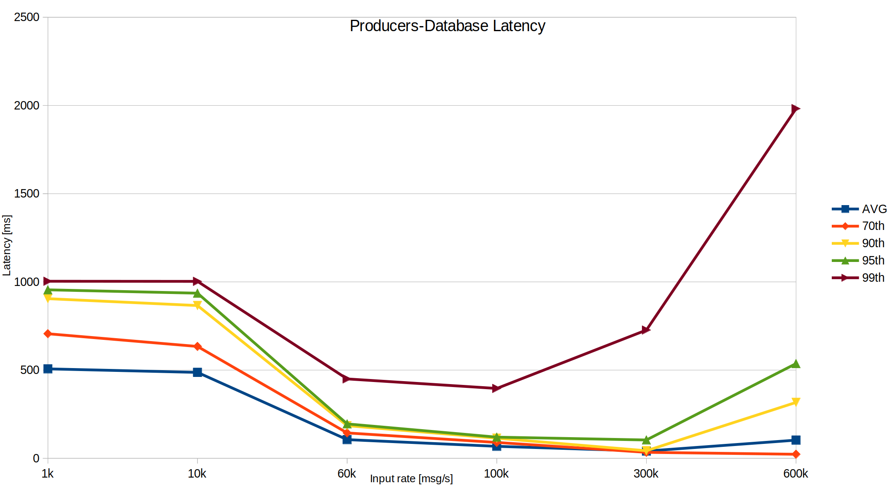

# [WIP] Monitoring system implementation based on Modular Stack

## 1. Goal

The goal of the monitoring system is to provide experts and shift crew in the ALICE Control Centre with an in-depth state of the O<sup>2</sup> computing farm. The near-real-time and historical graphical dashboards will allow users to interface easily with the large amount of monitoring data.
In order to process and supply monitoring metrics to the dashboards a set of tools were selected to meet the requirements specified in the [O<sup>2</sup> Technical Design Report](https://cds.cern.ch/record/2011297/files/ALICE-TDR-019.pdf) and  [O<sup>2</sup> Work Package 8 evaluation document](https://espace.cern.ch/alice-o2-wp8/Shared%20Documents/Monitoring/WP8-Monitoring-evaluation.pdf).

The selection criteria were approved by [O<sup>2</sup> TB in August 2017](https://indico.cern.ch/event/630547/contributions/2699553/attachments/1514045/2362116/O2-TB-Monitoring-evaluation.pdf). The WP8 [tools selection recommendation](https://indico.cern.ch/event/686148/contributions/2880669/attachments/1593253/2524202/TB-monitoring-evaluation.pdf) was approved by O<sup>2</sup> TB in February 2018.

In 2019, it was decided to replace [CollectD with Telegraf](https://indico.cern.ch/event/689265/contributions/3244748/attachments/1769050/2873555/WP8_Meeting_2018_12_11_MontoringSystem_CurrentStatus_2.pdf) and [Flume and Spark with Kafka](https://indico.cern.ch/event/797462/contributions/3313482/attachments/1798490/2932686/WP8_Meeting_2019_01_MontoringSystem_CurrentStatus.pdf).

## 2. Functional architecture

Figure 1 shows the functional architecture of the system. Three monitoring data sources were identified: Applications, Process, System related.


<p align="center">Figure 1. Monitoring architecture</p>

These data sources send the monitoring data periodically to the server-side processing and aggregation task which can perform stream or batch operations such as: Suppression, Enrichment, Correlation, Custom aggregation and others.

Afterwards data are forwarded to both storage and real-time dashboard. The storage supports high input metric rate, low storage size and downsampling. The near-real-time dashboard receives selected, processed metrics as soon as it is possible in order to allow experts to react to abnormal situations. This imposes a need for low latency transport protocol.
The historical dashboard displays data from the storage. As it has access to a larger variety of metrics it is mostly used by experts in order to drill down the issues and access detailed views.
These dashboards display data as time series plots, gauges, bar, and other graphical objects. They allow access from various operating systems and from outside of the experimental area (Point 2).
Eventually, the alarming component detects abnormal situations and notifies the experts by email, text messages or other means of notifications to quickly reaching them.

## 3. The Modular Stack
The Modular Stack solution aims at fulfilling the requirements specified in Section 1 by using multiple tools. Such an approach enables the possibility of replacing one or more of the selected components in case alternative options provide improved performance or additional functionalities.
This section gives an overview of Modular Stack components, see Figure 2, while the detailed description can be found in the following chapters.


<p align="center">Figure 2. Modular Stack architecture</p>


The O<sup>2</sup> Modular Stack collects three classes of metrics (as defined in Section 2) with the assistance of the [O<sup>2</sup> Monitoring library](http://github.com/AliceO2Group/Monitoring) (Application and process metrics)
and [Telegraf](https://docs.influxdata.com/telegraf/) (System metrics). Telegraf deploys system sensors to collect metrics related to CPU, memory and I/O from all O<sup>2</sup> nodes. The core component (Apache Kafka) ensures high throughput, data pipelines and fault-tolerant services  in order to collect, route and process metrics. [InfluxDB](https://docs.influxdata.com/influxdb/v1.5/), "a custom high-performance data store written specifically for time series data", was selected as a storage backend. [Grafana](https://grafana.com/) provides graphical interfaces to display near real-time and historical metrics.

### 3.1 Monitoring library - application and process performance metrics

The [O<sup>2</sup> Monitoring library](https://github.com/AliceO2Group/Monitoring) is an entry point for the O<sup>2</sup> processes to the Monitoring subsystem. It forwards user defined and [process performance](https://github.com/AliceO2Group/Monitoring/blob/dev/README.md#monitoring-process) metrics to one of the [supported backends](https://github.com/AliceO2Group/Monitoring/blob/dev/README.md#monitoring-instance). It also allows to calculate [derived metrics](https://github.com/AliceO2Group/Monitoring/blob/dev/README.md#calculating-derived-metrics) (eg. rate) and supports [metric buffering](https://github.com/AliceO2Group/Monitoring/blob/dev/README.md#buffering-metrics) in order to improve the efficiency metric transport and decrease number context switches.

The detailed description of the library in available in the [README](https://github.com/AliceO2Group/Monitoring/blob/dev/README.md) file.

### 3.2 Telegraf - system sensors

Telegraf provides system sensors and it uses custom plugins to scrape metrics from various O<sup>2</sup> services and hardware (like CRU, CCDB). Offers a large set of plugins able to collect heterogeneous metrics from the hardware and operating system (CPU, memory, network, SNMP and IPMI). It outputs metrics in a compact format called InfluxDB Line Protocol. This protocol uses labels (aka tags) to better identify carried values. It also acts as a local collector - it receives metrics from all monitoring library instances on a given host over Unix socket and forwards them to Kafka in batches.

#### 3.2.1 System sensors
The following plugins were selected in order to provide system overview of each node:
- [cpu](https://github.com/influxdata/telegraf/tree/master/plugins/inputs/cpu)
- [mem](https://github.com/influxdata/telegraf/tree/master/plugins/inputs/mem)
- [net](https://github.com/influxdata/telegraf/blob/master/plugins/inputs/net/NET_README.md)
- [system](https://github.com/influxdata/telegraf/tree/master/plugins/inputs/system)
- [kernel](https://github.com/influxdata/telegraf/tree/master/plugins/inputs/kernel)
- [disk](https://github.com/influxdata/telegraf/tree/master/plugins/inputs/disk)
- [diskio](https://github.com/influxdata/telegraf/tree/master/plugins/inputs/diskio)

#### 3.2.2 Custom scrapers

Custom scrapes use following plugins:
- `inputs.exec` to execute bash scripts
- `inputs.http` to scrape JSON-encoded metrics and transform them into InfluxDB Line Protocol

#### 3.2.3 Local collector

In order to collect metrics from monitoring library instances `unixgram://` socket from `inputs.socket_listener` is used.
Telegraf creates Unix socket file with `telegraf:telegraf` permission what limits the processes that can write to it.

The metrics are output to Kafka using `outputs.kafka` plugin.

### 3.3 Apache Kafka - Collection, processing and routing

Apache Kafka has been selected to collect all data coming from all hosts, process that data and route it towards specific endpoints. A Kafka cluster is able to provide these functionalities in a scalable, fault-tolerant, fast and distributed way. The processing feature is covered using Apache Kafka Streams.

#### 3.3.1 Producers

In Kafka, Producers are those components that send data to the Kafka cluster. In this project, Telegraf and the Monitoring library instances are the Kafka producers.

#### 3.3.2 Consumers

Kafka Consumers are those components that retrieve data from a specific topic belonging to a Kafka Cluster in order to forward to external endpoints. Consumers have been used to write data in the database (InfluxDB), send notifications by email and Mattermost messages and retrieve live notifications to show on the Web UI.

#### 3.3.3 Scalability - Broker, Topic, Replication factor

Most of the Kafka features (e.g. scalability, fault-tolerance and data pipelines) are accomplished thanks to the concept of topic: a stream of messages sharded into partitions. These partitions are replicated and distributed for high availability into Kafka servers (aka brokers). Scalability is achieved by partition configuration, increasing the topic partitions leads to higher throughput. The fault-tolerance is controlled by a replication factor: the higher the replication factor is the more broker failures can be tolerated. Kafka uses Apache Zookeeper to manage brokers, topics and partitions dynamically and with high reliability.

#### 3.3.4 Processing - Kafka Streams

Processing tasks have been implemented using Kafka Streams that inherits scalability and fault-tolerance features from Kafka. This library allows to implement both stateless (per message) and stateful (aggregation) processing tasks. Applications read and write data in topics belonging to the Kafka cluster.

#### 3.3.5 Custom Kafka components
Even if Kafka provides scalability, fault-tolerant and data pipelines features, custom components are necessary in order to meet requirements.

##### 3.3.5.1 InfluxDB UDP Consumer
Being a consumer, this component retrieves messages from a particular topic belonging to the Kafka cluster in order to forward them to the InfluxDB instance (1.X version). Even if are available an [official InfluxDB consumer](https://docs.confluent.io/current/connect/kafka-connect-influxdb/influx-db-sink-connector/index.html), a custom component has been implemented in order to reach the highest database writing rate and reliability. Differently from the official one, this component sends messages via UDP. Moreover, multiple destination ports can be used to increase the InfluxDB insertion rate: a round robin selection provides an uniform incoming data in each port. The implemented InfluxDB consumer expects input messages using the [InfluxDB Line protocol format](#3361-influxdb-line-protocol-format) and forwards them directly to the database. Multiple InfluxDB consumer instances along with an input topic configured with multiple partitions allow to split up the workload and achieve better performance. Finally, the component could be configured to send inner monitoring data to an InfluxDB instance via UDP.

##### 3.3.5.2 InfluxDB HTTP Consumer
This consumer has been implemented to be used with the InfluxDB 2.0 version. This consumer uses the HTTP procotol, the unique possibile one available on the new version of database. Multiple InfluxDB consumer instances along with an input topic configured with multiple partitions allow to split up the workload and achieve better performance.

##### 3.3.5.3 Mattermost Consumer
This component retrieves messages from the Kafka cluster and forwards them to the HTTP Mattermost endpoint. In order to successfully receive messages in Mattermost, an [Incoming Webhooks](https://docs.mattermost.com/developer/webhooks-incoming.html) must be created before. Only JSON messages and compliant to the Grafana notification message format are ingested and processed. Following an example of a well written message:

```JSON
{
  "description": "Test notification - Someone is testing the alert notification within grafana",
  "client_url" : "http://<grafana-instance>:3000",
  "details"    : "Triggered metrics:\nHigh value: 100.000\nHigher Value: 200.000"
}
```

The above JSON is converted in a Mattermost message. Only the `description` field is mandatory, the remaining two ones are shown if present. Multiple consumer instances along with an input topic configured with multiple partitions allow to split up the workload and achieve better performance. Finally, the component could be configured to send inner monitoring data to an InfluxDB instance via UDP.

##### 3.3.5.4 Email Consumer
This component retrieves messages from a particular topic belonging to a Kafka cluster and sends emails. Only JSON messages containing `subject`, `body` and `to_addresses` fields are ingested and processed. Following an example of a well written message:

```JSON
{
  "subject": "Title1",
  "body" : "Dear experts,\n there is a notification for you\n\nCheers,\nMonitoring Team",
  "to_addresses"    : "expert1@cern.ch,expert2@cern.ch"
}
```

All JSON fields are mandatory. Multiple consumer instances along with an input topic configured with multiple partitions allow to split up the workload and achieve better performance. Finally, the component could be configured to send inner monitoring data to an InfluxDB instance via UDP.

##### 3.3.5.5 Aggregator Processor
The aggregator component retrieves messages from a topic of a Kafka cluster, splits them up in configurable time windows and processes them using the following four aggregation functions:
- average
- sum
- minimum
- maximum

A dedicated format, called [internal format](#3362-internal-format), is required to process correctly data. The aggregated values are formatted using the [InfluxDB Line protocol format](#3361-influxdb-line-protocol-format) and are written to the output topic. Multiple processor instances along with an input topic configured with multiple partitions allow to split up the workload and achieve better performance. Finally, the component could be configured to send inner monitoring data to an InfluxDB instance via UDP.

##### 3.3.5.6 OnOff Processor
This component extracts messages whose value is changed respect the last stored value and forwards them to an output topic. Moreover, periodically it sends all stored values to the output topic. A dedicated format, called [internal format](#3362-internal-format), is required to process correctly data. Multiple processor instances along with an input topic configured with multiple partitions allow to split up the workload and achieve better performance. Finally, the component could be configured to send inner monitoring data to an InfluxDB instance via UDP.

##### 3.3.5.7 Router
This component is able to filter, change format and route input messages to dedicated output topics. Input messages must be formatted using the [InfluxDB Line Protocol](#3361-influxdb-line-protocol-format) format. Messages could be forward to an InfluxDB instance by means of [InfluxDB Consumer](#3351-influxdb-consumer): messages are before filtered and then forwarded as they are to the consumer topic. Input messages could be also forwarded to [OnOff Processor](#3356-onoff-processor) and the [Aggregator Processor](#3355-aggregator-processor) topics: in this case data is filtered and converted to the [internal format](#3362-internal-format) before sending. As it will be explained in the dedicated section, a message using the internal format contains a single field, then the component creates as much output messages (using the Internal format) as the number of fields contained in the input messages (using the InfluxDB Line Protocol format). Multiple instances along with an input topic configured with multiple partitions allow to split up the workload and achieve better performance. Finally, the component could be configured to send inner monitoring data to an InfluxDB instance via UDP.

#### 3.3.6 Message Format

##### 3.3.6.1 InfluxDB Line Protocol Format
This format, invented from InfluxData, is composed of a single string containing measurement name, multiple tags, multiple fields and a timestamp. The format uses comma, space and equals characters to serialize and deserialize data. Following an example:

`<measurement>,<tags> <field_name1>=<field_value1>,...,<field_nameN>=<field_valueN> <timestamp>`

Integer, double, boolean and string data type fields are supported.

[Official reference page](https://docs.influxdata.com/influxdb/v1.7/write_protocols/line_protocol_reference/).

##### 3.3.6.2 Internal Format
This format has been created in order to take advantage of the policy used from Kafka to split up messages among the topic partitions. Inserting a dedicated key in the message is possible to ensure that all messages having the same key will be in the same topic partition, making easier process data.
The internal format is a key-value pair, both string types, where:
- key: `<measurement_name>#<field_name>`
- value: `<tags>#<field_value>#<timestamp>`

#### 3.3.7 Kafka system
This section describes how the above components are interconnected among them in order to achieve the required functionalities. Incoming data is received from Telegraf and the Monitoring Library and containing information about systems, processes and applications. Part of this data is supposed to be written directly in the database and another part should be processed using the Aggregator and OnOff Processors before to be sent to the InfluxDB instance. The selection and routing of input data is executed from the Route Component: input messages satisfying specific conditions are sent to the [InfluxDBConsumer](#3351-influxdb-consumer) keeping the same [InfluxDB Line Protocol](#3361-influxdb-line-protocol-format) format of input messages. Same kind of filtering operations are executed before to send input data to [Aggregator Processor](#3355-aggregator-processor) and the [OnOff Processor](#3356-onoff-processor) but in this case messages are converted to the [internal format](#3362-internal-format). The Aggregator and the OnOff Processors read the input data, execute own processing task and send the processed value to the InfluxDB consumer using the [InfluxDB Line Protocol](#3361-influxdb-line-protocol-format) format.

In Kafka, information can be exchanged among components only using topics: each component need at least one topic where read messages. This means that consumers ([InfluxDBConsumer](#3351-influxdb-consumer), [EmailConsumer](#3354-email-consumer)  and [MattermostConsumer](#3353-mattermost-consumer)) have own topics (`influxdb-topic`, `email-topic` and `mattermost-topic`). Likewise, for the [Aggregator Processor](#3355-aggregator-processor) and the [OnOff Processor](#3356-onoff-processor) `aggregator-topic` and `onoff-topic` must be created. To activate a given component, consumer or processor, is necessary at least another component writes data in the input topic(s) related.

The following figure shows what above has been described.


<p align="center">Figure 3. Kafka internal connection of Router, AggregatorProcessor, OnOffProcessors and InfluxDBConsumer components</p>

#### 3.3.8 Kafka monitoring

Apache Kafka brokers and clients report many internal metrics using JMX. Kafka statistics are exposed using Jolokia and collected over HTTP using Telegraf using the `inputs.jolokia2_agent` plugin.
A not-complete set of collected metrics are:
- Input messages per topic;
- input/output bytes per topic;
- number of user-replica partitions;
- number of partitions don’t have an active leader and are hence not writable or readable;
- number of active controller in the cluster;
- request, produce and fetch rate;
- latency.

### 3.4 InfluxDB - Storage
The goal of the storage is to archive time-series metrics for the historical dashboard.

[InfluxDB](https://docs.influxdata.com/influxdb/v1.5/) is a "custom high-performance data store written specifically for time series data. It allows for high throughput ingest, compression and real-time querying of that same data".
It supports [Continuous Queries and Retention Policies](https://docs.influxdata.com/influxdb/v1.5/guides/downsampling_and_retention/), that help to automate the process of downsampling data.

#### 3.4.1 Data organisation
In order to scale the storage efficiently it is foreseen to use multiple instances of InfluxDB. In addition, single [ifql](https://github.com/influxdata/ifql/) process will serve READ queries from all the instances. InfluxDB do not provide high availability and horizontal scalability features in the open source version, so custom solutions has been considered.
InfluxDB instances are specialised in storing given subset of metrics and aggregated or raw data metrics.

(...)

#### 3.4.2 Retention Policies and Continuous Queries
Retention policies and continuous queries allow to minimise the disk usage. The goal is to store high time resolution data for a short period and low resolution data for a longer time period. In order to adjust continuous queries and retention policies for the O<sup>2</sup> sample monitoring data is required.
The details are tracked in the [OMON-123](https://alice.its.cern.ch/jira/browse/OMON-123) issue.

(...)

### 3.5 Grafana - Dashboards
[Grafana](https://grafana.com) was chosen as data visualisation tool. It allows to create custom dashboards easily.
It is able to retrieve data from [InfluxDB](http://docs.grafana.org/features/datasources/influxdb/) and the [real-time data source](https://github.com/grafana/grafana/issues/4355) is foreseen to be implemented in a future release.
 Thanks to [organisations](http://docs.grafana.org/guides/basic_concepts/#organization) and [teams](http://docs.grafana.org/guides/whats-new-in-v5/#teams) single instance of Grafana could cover whole O<sup>2</sup> project.
In addition, [new provisioning](http://docs.grafana.org/guides/whats-new-in-v5/#data-sources) feature allows to set up new instance within seconds.

#### 3.5.1 CERN SSO integration
Grafana integrates with [CERN SSO](http://docs.grafana.org/installation/configuration/#auth-generic-oauth) which was successfully tested.
The following configuration is needed:
```
[auth.generic_oauth]
enabled = true
name = CERN SSO
allow_sign_up = true
client_id = {{ grafana_oauth_client_id }}
client_secret = {{ grafana_oauth_client_secret }}
scopes = https://oauthresource.web.cern.ch/api/User
auth_url = https://oauth.web.cern.ch/OAuth/Authorize
token_url = https://oauth.web.cern.ch/OAuth/Token
api_url = https://oauthresource.web.cern.ch/api/User
```

#### 3.5.2 Live data source

The Live data sources are scheduled in the [Grafana roadmap](https://github.com/grafana/grafana/blob/master/ROADMAP.md) as `In a distant future far far away` which means it should be implemented not earlier than Q4 2018.

It also considered to contribute this future to Grafana: [OMON-139](https://alice.its.cern.ch/jira/projects/OMON/issues/OMON-139).

(...)

### 3.6 Alarming
The alarming component sends notification to experts when abnormal behaviours are detected. Custom Kafka Streams components and Grafana are used to identify these scenarios. All alarming are collected in a dedicated topics in the Kafka cluster and forward using email or Mattermost messages.

### 3.7 Notification service

A Web UI is provided that show live notifications retrieved from a topic in the Kafka cluster.

## 4. Deployment
In order to quickly and flawlessly deploy the monitoring tools [Ansible roles](https://gitlab.cern.ch/AliceO2Group/system-configuration/tree/master/ansible) were prepared for the following components:
- Telegraf
- Kafka
- Kafka REST Proxy
- InfluxDB
- Grafana

## 5. Hardware

### 5.1 InfluxDB node

#### 5.1.1 InfluxDB 1.7

The InfluxDB related performance requirements are:
- Write up to 600 k value/s
- Execute continuously inner metric aggregation tasks (continuous queries)
- Serve queries to load Grafana dashboards as fast as possible
- Store data: 3-7 days for the raw data; 300 days for historical aggregated data

In order to translate above database specific requirements into hardware requirements two extensive write tests were performed.
Following, the hardware specifications of the machine hosting the InfluxDB instance under test.
- CPU: Xeon E5-2670
- RAM: 64 GB
- Storage: 1.5TB (DELL PERC H730 Mini) SSD matrix
- Ethernet: 40 Gbps

**Scenario 1**: **300 k msg/s** were sent to Kafka and then to InfluxDB using 3 custom InfluxDB Kafka Consumers. The results are the following:
- CPU usage (avg): 1200%
- RAM usage: 11 GB
- Incoming traffic: 36 MB/s
- Disk usage:
  - Raw database: 70 GB (3 days)
  - Historical database: 250 GB (estimated using 6h test results, aggregated to 1 point per minute)

**Scenario 2**: Sending **600 k msg/s**:
- CPU usage (avg): 2600% avg
- RAM usage: 15 GB
- Incoming traffic: 70 MB/s with extremely high packet rate


<p align="center">Figure 4. InfluxDB hardware estimation (TOTAL CPU = 24 cores, TOTAL RAM = 64 GB)</p>

**Scenario 3**: Estimation of loading single Grafana dashboard:
TODO

Based on above tests the recommended specification for the InfluxDB node is:
- CPU: 20+ high performance cores
- RAM: 128+ GB
- Disk size: 3+ TB
- Disk IO: 10k IOPS (4KB, QD1), 70k IOPS (4KB, QD32)
- Disk reliability: medium (during TSs and LSs data will be backed up to EOS)
- Network: 20+ Gbps

#### 5.1.2 InfluxDB 2.0

TO DO

### 5.2 Kafka nodes

#### Kafka brokers

The Kafka broker related performance requirements are:
- Manage >= 1000 of data sources
- Manage at least 600k value/s
- Do not introduce delay higher than the given requirement

Tests has been done to measure the resource usage for each of three Kafka brokers while sending 600k and 300k value/s:
The following hardware specifications have been used to host each Kafka broker during the tests.
- CPU: Xeon E5-2640 v3
- RAM: 128 GB
- Ethernet: 40 Gbps

**600k value/s**
- CPU usage avg: 150%, peak: 600%
- RAM usage: 11GB
- Incoming traffic: 80MB/s
- Outgoing traffic: 60MB

**300k value/s**
- CPU usage avg: 150%, peak: 600%
- RAM usage: 11GB
- Incoming traffic: 50MB/s
- Outgoing traffic: 50MB
- Disk usage: 30 GB (2 high dense data topics with 5 minutes of retention policy)


<p align="center">Figure 5. Kafka hardware estimation</p>

#### Kafka components

Kafka consumers and Kafka Stream related processing performance requirements are:
- Perform tasks using as less resources as possible

| Component Name        | CPU usage [%] | RAM usage [GB]  |
| :-------------: |:-------------:| :-----:|
| InfluxDB Consumer | 150 | 10 |
| Router | 150 |   10 |
| OnOff | 100 | 2 |
| Aggregator | 140 | 3 |


The On each machine executes a kafka broker and all kafka component types
- CPU: 16+ low performance cores
- RAM: 64+ GB
- Disk size: 500+ GB
- Disk IO: 15k IOPS (4KB, QD32), priority: sequential write
- Disk reliability: very low (irrelevant)
- Network: 10+ Gbps

### 5.3 Grafana node

In order to evaluate Grafana hardware requirements a simple Google Headless test was performed: A dummy dashboard containing 5 plots (14 curves) and 6 months of data (data point every 30 second) was loaded every 1 second. During the test `grafana-server` process utilized:
- 6% of 16 core (E5520) CPU
- 0.5% of 32 GB RAM

In comparison the `influxd` process running at the same machine utilized 500% of the same CPU, and 3% of RAM.

## 6 Overall tests

### 6.1 Producers-Database Latency 
In order to measure the producers-database latency a Kafka cluster and the InfluxDB instance has been used. The producer has been implemented in order to send messages containing the generation time (unix epoch format) as value without the timestamp field: the Influxdb instance will add it once the record is written on disk. Finally, the latency is evaluated extracting the difference between the two timestamps. All used machines have sub milliseconds delay among them (ntp synchronization).
For the test a three broker Kafka cluster has been used deployed on the [Kafka nodes](#52-kafka-nodes) and an InfluxDB 2.0 instance has been installed on the [InfluxDB node](#51-influxdb-node). The [HTTP influxDB Kafka consumer](#3352-influxdb-http-consumer) has been used. The returned latency statistic as function of the input reate is inserted in the following table and plotted in the Figure 6.

| Input rate [kHz]   |  Average latency [ms] | 70th percentile latency [ms] | 90th percentile latency [ms] | 95th percentile latency [ms] | 99th percentile latency [ms] 
| :-------------: |:-------------:| :-----:|:-----:|:-----:|:-----:|
| 1 | 507 | 706 | 905 | 955 | 1004 |
| 10 | 487 | 634 | 868 | 936 | 1003 |
| 60 | 106 | 144 | 185 | 195 | 450 |
| 100 | 68 | 90 | 114 | 120 | 396 |
| 300 | 41 | 34 | 43 | 104 | 727 |
| 600 | 103 | 23 | 317 | 537 | 1982 |
| 700 | - | - | - | - | - |
| 800 | - | - | - | - | - |
| 900 | - | - | - | - | - |



<p align="center">Figure 6. Producers-Database latency statistics as a function of the input rate</p>


### Team
 - [jvino](https://github.com/jvino) - Gioacchino Vino
 - [awegrzyn](https://github.com/awegrzyn) - Adam Wegrzynek
