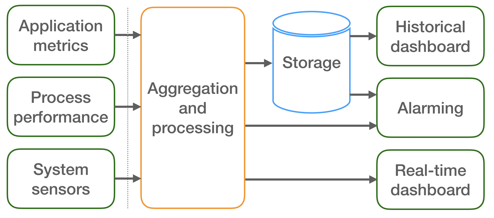

# [WIP] Monitoring system implementation based on Modular Stack

## 1. Goal

The goal of the monitoring system is to provide experts and shift crew in the ALICE Control Centre with an in-depth state of the O<sup>2</sup> computing farm. The near-real-time and historical graphical dashboards allow users to interface easily with the large amount of monitoring data.
In order to process and supply monitoring metrics to the dashboards a set of tools were selected to meet the requirements specified in the [O<sup>2</sup> Technical Design Report](https://cds.cern.ch/record/2011297/files/ALICE-TDR-019.pdf) and  [O<sup>2</sup> Work Package 8 evaluation document](https://espace.cern.ch/alice-o2-wp8/Shared%20Documents/Monitoring/WP8-Monitoring-evaluation.pdf).

The selection criteria were approved by [O<sup>2</sup> TB in August 2017](https://indico.cern.ch/event/630547/contributions/2699553/attachments/1514045/2362116/O2-TB-Monitoring-evaluation.pdf). The WP8 [tools selection recommendation](https://indico.cern.ch/event/686148/contributions/2880669/attachments/1593253/2524202/TB-monitoring-evaluation.pdf) was approved by O<sup>2</sup> TB in February 2018.

## 2. Functional architecture

Figure 1 shows the functional architecture of the system. Three monitoring data sources were identified: Applications, Process, System related.



<p align="center">Figure 1. Monitoring architecture</p>

These data sources send the monitoring data periodically to the server-side processing and aggregation task which can perform stream or batch operations such as: Suppression, Enrichment, Correlation, Custom aggregation and others.

Afterwards data are forwarded to both storage and real-time dashboard. The storage supports high input metric rate, low storage size and downsampling. The near-real-time dashboard receives selected, processed metrics as soon as it is possible in order to allow experts to react to abnormal situations. This imposes a need of low latency transport protocol.
The historical dashboard displays data from the storage. As it has access to a larger variety of metrics it is mostly used by experts in order to drill down the issues and access detailed views.
These dashboards display data as time series plots, gauges, bar, and other graphical objects. They allow access from various operating systems and from outside of the experimental area (Point 2).
Eventually, the alarming component detects abnormal situations and notifies the experts by email, text messages or other means of notifications to quickly reaching them.

## 3. The Modular Stack
The Modular Stack solution aims at fulfilling the requirements specified in the Section 1 by using multiple tools. Such approach enables the possibility of replacing one or more of the selected components in case alternative options provide improved performance or additional functionalities.
This section gives an overview of Modular Stack components, see Figure 2, while the detailed description can be found in the following chapters.


<p align="center">Figure 2. Modular Stack architecture</p>


The O<sup>2</sup> Modular Stack collects three classes of metrics (as defined in Section 2) with assistance of the [O<sup>2</sup> Monitoring library](http://github.com/AliceO2Group/Monitoring) (Application and process metrics)
and [CollectD](http://collectd.org/) (system information). Collectd deploys system sensors to collect metrics related to CPU, memory and I/O from all O<sup>2</sup> nodes. The requirements of high monitoring metric rate collection and metric routing are addressed via [Apache Flume](https://flume.apache.org/), "a distributed and highly-reliable service for collecting, aggregating and moving large amounts of data in a very efficient way". Moreover, Flume can also run simple processing tasks. [InfluxDB](https://docs.influxdata.com/influxdb/v1.5/), "a custom high-performance data store written specifically for time series data", was selected as a storage backend. [Grafana](https://grafana.com/) provides graphical interfaces to display near real-time and historical metrics. [Riemann](http://riemann.io/) triggers alarms using multiple plugins and allows to implement some processing tasks. All remaining and complex processing tasks are implemented through [Apache Spark](https://spark.apache.org/), "a fast and general-purpose engine for large-scale data processing".

### 3.1 Sensors and data sources
As explained in the Section 2 three classes of metrics are collected using O<sup>2</sup> Monitoring library and CollectD:
- Application - user defined metrics injected via Monitoring library API
- Process - process performance related metrics automatically generated by the Monitoring library
- System - system metrics provided by collectD plugins.

This section provide more details regarding these tools.

#### 3.1.1 Monitoring library - application and process performance metrics

The [O<sup>2</sup> Monitoring library](https://github.com/AliceO2Group/Monitoring) is an entry point for the O<sup>2</sup> processes to the Monitoring subsystem. It forwards user defined and [process performance](https://github.com/AliceO2Group/Monitoring/blob/dev/README.md#monitoring-process) metrics to one of the [supported backends](https://github.com/AliceO2Group/Monitoring/blob/dev/README.md#monitoring-instance). It also allows to calculate [derived metrics](https://github.com/AliceO2Group/Monitoring/blob/dev/README.md#calculating-derived-metrics) (eg. rate) and supports [metric buffering](https://github.com/AliceO2Group/Monitoring/blob/dev/README.md#buffering-metrics) in order to improve the efficiency metric transport and decrease number context switches.

The detailed description of the library in available in the [README](https://github.com/AliceO2Group/Monitoring/blob/dev/README.md) file.

#### 3.1.2 Collectd - system metrics
The following collectD plugins were selected in order to provide system overview of each node:

| Plugin    | Metric description | Requirements | Comments |
| --------- | ------------------ | ------------ | -------- |
| CPU       | Amount of time spent by the CPU in various states (user, system, io, idle, irq) | `/proc` | Percentage (`ValuesPercentage true`) |
| Interface | Throughput, packets/second and errors/second per interface | `/proc` | List of interfaces can be defined |
| Memory    | Memory utilisation (Used, Buffered, Cached, Free) | `/proc` | - |
| DF        | Used and available disk space per mounted partition | `statfs`, `getmntent` | List of partitions can be defined |
| Load      | System load as 1, 5, 15 minutes average | `/proc` | - |
| Uptime    | Execution time; current, average and maximum | `/proc` | - |
| Disk      | Disk performance metrics per read and write: average time, operation per second, io time and more | `/proc/diskstats` | - |
| Logfile   | Internal; writes collectd logs into a file | - | - |
| IMPI      | Uses the OpenIPMI library to read hardware sensors from servers | [OpenIPMI](https://sourceforge.net/projects/openipmi/) | TBD: [OMON-144](https://alice.its.cern.ch/jira/browse/OMON-144)  |
| SNMP      | Uses the Net-SNMP library to read values from network devices | [Net-SNMP](http://net-snmp.sourceforge.net) | TBD: [OMON-145](https://alice.its.cern.ch/jira/browse/OMON-145) |
| SMART     | Reads Self-Monitoring, Analysis and Reporting Technology information from hard disk drives | `libatasmart`, `libudev` | TBD: [OMON-146](https://alice.its.cern.ch/jira/browse/OMON-146) |
Data from collectd can be transferred by one of two plugins:
 - [Network](https://collectd.org/wiki/index.php/Plugin:Network) - binary protocol over UDP
 - [Write HTTP](https://collectd.org/wiki/index.php/Plugin:Write_HTTP) - Formats data JSON and send over HTTP

The former plugin sends metrics directly to InfluxDB which understands CollectD native protocol.
The latter plugin writes JSON encoded metrics through HTTP what can be received by Apache Flume CollectD handler (see Section 3.2.3). This gives the possibility to forward system metrics to processing if necessary, e.g. for aggregation and alerting tasks. The incoming rate is estimated at ~200 requests per second (2000 CollectD daemons pushing data every 10 seconds). Currently both solutions are used depending on a set-up.

Below, a sample JSON metric generated by the `disk` plugin sent over HTTP by the `http_write` plugin is shown:

```JSON
[{ "values": [197141504, 175136768],
   "dstypes": ["counter", "counter"],
   "dsnames": ["read", "write"],
   "time": 1251533299.265,
   "interval": 10,
   "host": "o2.cern.ch",
   "plugin": "disk",
   "plugin_instance": "sda",
   "type": "disk_octets",
   "type_instance": ""
   }
]
```

The `values`, `dstypes` and `dsname` fields are arrays of the same size allowing to accommodate multiple metrics. In the example two values, types and names are specified.

The `dstypes` field defines the value type:
- `counter` or `absolute` - unsigned integer
- `derive` - signed integer
- `gauge` - double.

### 3.2 Apache Flume - Collection and routing
The  goal of this component is to receive monitoring data from the sensors (collectD) and O<sup>2</sup> processes (via Monitoring library) and route them towards one of the following tools (as shown in Figure 2):
- Historical storage (InfluxDB)
- Near real-time dashboard (Grafana)
- Alarming (Riemann)
- Processing (Apache Spark).


<p align="center">Figure 3. Flume agent</p>

A Flume instance runs an agent, which is a "process that hosts the components through which events flow from an external source to the next destination (hop)". An agent consists of following components (see Figure 3):
- Source - Receives metrics and formats them into a Flume event
- Channel - Disk or memory buffer
- Channel Selector - Selects an outgoing channel or channels based on event properties such as a metric name or a dedicated property for this purpose; This property could be set either in a source interceptor or by the Monitoring library.
- Sink - Translates Flume events into desirable format and sends it to a backend
- Interceptor - Basic manipulation on Flume events.

Apache Flume provides a wide range of built-in components, especially for widely used communication protocols and Hadoop ecosystem tools. In order to interface with all Modular Stack tools some custom components were developed:
- [InfluxDB Sink](https://github.com/AliceO2Group/MonitoringCustomComponents/tree/master/flume-udp-influxdb-sink) - pushes events to InfluxDB via UDP
- Grafana Sink - (...)
- Riemann Sink - (...)
- [UDP/JSON Source](https://github.com/AliceO2Group/MonitoringCustomComponents/tree/master/flume-udp-source) - collects metrics sent from the [O<sup>2</sup> monitoring library](https://github.com/AliceO2Group/Monitoring) via UDP as JSON encoded strings
- [Collectd JSON Handler](https://github.com/AliceO2Group/MonitoringCustomComponents/tree/master/flume-json-collectd-http-handler) - reads the data provided by CollectD [write_http](https://collectd.org/wiki/index.php/Plugin:Write_HTTP) plugin.

The Figure 4 shows how the Flume components are connected with each other.


<p align="center">Figure 4. Flume internal architecture</p>

#### 3.2.1 Flume Event
Flume transports metrics in the data structure called Event, which consists of:
- byte array payload
- set of string attributes (optional).

It was decided to keep metric name, values, tags and timestamp as string attributes and leave array payload empty. In addition, tag names are prefixed with `tag_` and value names with `value_`. Therefore, each Flume Event consists of following string attributes:
- `name`
- `timestamp` - UNIX epoch time
- `tag_host` - hostname of a metric origin
- `value_*` - a value (at least one is required)
- [`tag_*`] - optional tags

#### 3.2.2 UDP/JSON Source

The UDP/JSON Source receives metrics from the Monitoring library. The UDP protocol was chosen as it allows receiving data from thousands of nodes. In addition, it drops the data (instead of queuing them) when the receiving part is busy, what is desired behaviour.
There can be one or more metrics in a single UDP packet. The metrics are formatted as Flume Events already in the Monitoring library what eliminates the need of parsing on the Flume side.
A sample metric looks like below:
```JSON
[{
  "headers" : {
    "timestamp" : "434324343",
    "tag_host" : "o2.cern.ch",
    "name" : "cpu",
    "value_idle" : "0.13"
  },
  "body" : ""
}]
```

The information how build and configure UDP/JSON Source is provided in the [GitHub README](https://github.com/AliceO2Group/MonitoringCustomComponents/tree/master/flume-udp-source).

#### 3.2.3 CollectD JSON Handler

The monitoring data coming from CollectD daemons are received by the native HTTP Source. As Flume is not able to decode the CollectD format a [Collectd JSON Handler](https://github.com/AliceO2Group/MonitoringCustomComponents/tree/master/flume-json-collectd-http-handler) was developed. It parses JSON encoded metrics and converts them into Flume events.
It creates multiple Flume Events per each metric specified in the given position of `values`, `dstypes` and `dsname` arrays.

The following Flume Event headers are defined:
- `timestamp` - `time` converted into nanoseconds (`long` type)
- `tag_host` - `host` value
- `name` - `plugin` name concatenated with `dsnames` eg. `disk_read`, `disk_write`.
- `value_value` - given `dstypes` value
- [`type_value`] - `long` for `counter`, `absolute` types and `double` for `gauge` type
- `tag_plugin_instance` - `plugin_instance` value
- `tag_type` - `type` value

Following the above mapping, the CollectD JSON object shown in Section 3.2.2 produces the following Flume Events:
```JSON
[{"headers" : {
    "timestamp" : "1251533299265000000",
    "tag_host" : "o2.cern.ch",
    "name" : "disk_read",
    "value_value":  "197141504",
    "type_value" : "long",
    "tag_plugin_instance": "sda",
    "tag_type": "disk_octets"
    },
  "body" : ""
  },
 {"headers" : {
    "timestamp" : "1251533299265000000",
    "tag_host" : "o2.cern.ch",
    "name" : "disk_write",
    "value_value" : "175136768",
    "type_value" : "long",
    "tag_plugin_instance": "sda",
    "tag_type": "disk_octets"
    },
  "body" : ""
  }
]
```

The details on how to build and configure CollectD JSON Handler are provided in the [Github README](https://github.com/AliceO2Group/MonitoringCustomComponents/tree/master/flume-json-collectd-http-handler).


#### 3.2.4 Spark Avro Source
[Avro Source](http://flume.apache.org/FlumeUserGuide.html#avro-source) receives metrics from Apache Spark. Alternatively, it is possible to use UDP/JSON Source for this purpose.

#### 3.2.5 InfluxDB Sink
The InfluxDB Sink takes a Flume Event from a channel, converts it to the [InfluxDB Line Protocol](https://docs.influxdata.com/influxdb/v1.5/write_protocols/line_protocol_reference/) and finally sends it in the UDP packet. The alternative solution of using HTTP requests was rejected due to a performance overhead.

The InfluxDB Line Protocol format is following:
```
"metric_name,tag1=key1,tag2=key2 value_name1=value1,value_name2=value2 timestamp_ns"
```

A value has 1 of 4 types:
-	Long - value suffixed with `i` character, example: `count=10i`.
-	Double - default, example: `idle=0.98`.
-	String - value quoted, example: `hostname=\"test-machine\"`.
-	Boolean - `true` or `false`, example: `ping=true`.

A sample Flume Event:
```JSON
[{"headers" : {
    "timestamp" : "434324343",
    "tag_host" : "o2.cern.ch",
    "tag_cpu" : "1",
    "tag_site" : "CNAF",
    "name" : "cpu",
    "value_idle" : "0.93",
    "value_user" : "0.03"
    },
  "body" : ""
  }
]
```

produces the following InfluxDB Line Protocol string:
```
"cpu,host=o2.cern.ch,site=CNAF,cpu=1 idle=0.93,user=0.03 434324343"
```

The details on how to build and configure InfluxDB Sink are provided in the  [Github README](https://github.com/AliceO2Group/MonitoringCustomComponents/tree/master/flume-udp-influxdb-sink)


#### 3.2.6 Grafana Sink
The near real-time Grafana Sink sends the data directly to the near real-time dashboard over WebSocket protocol.

This component will be developed as soon as Grafana real time sources are available.

(...)

#### 3.2.7 Riemann Sink
The Riemann Sink sends the data to the Riemann instance in order to trigger a notification.
Riemann accepts both HTTP and TCP.
The component has not been developed yet.

(...)

#### 3.2.8 Spark Avro Sink
The Spark Sink sends the data to Spark for further processing and aggregation. According to the [Spark Streaming - Flume integration documentation](https://spark.apache.org/docs/2.2.0/streaming-flume-integration.html) there are two approaches of sending data to Spark:
- Push-based
- Pull-based.

In the first approach, Spark acts like a Flume Avro Source, thus the Spark Sink simply becomes a built-in [Avro Sink](http://flume.apache.org/FlumeUserGuide.html#avro-sink). The Avro Source-Sink are preferred components for transfer data between Flume agents and are implemented with RPC server-client communication.
In the second approach, the Spark Sink buffers the events while "Spark uses a reliable Flume receiver and transactions to pull data from the sink".

Currently Push is used as Pull approach has some undesired effects:
- When Spark job restarts it begins processing the last retrieved data, even if it's already outdated; the rule "the new data has more priority than old" is not followed
- The time windows are not fixed.


#### 3.2.9 Information Enrichment Interceptor
The information Enrichment Interceptor adds additional string attributes to specific Flume events.
Currently, only [InfluxDB timestamp interceptor](https://github.com/AliceO2Group/MonitoringCustomComponents/tree/master/flume-influxdb-timestamp-interceptor) is available.

### 3.3 Apache Spark - Batch and streaming processing
Some of the processing task defined in the  Section 2 could be managed by Flume, eg. simple modification of a Flume Event fields.
The more advanced processing requires a dedicated software. [Apache Spark](https://spark.apache.org/), "a fast and general-purpose engine for large-scale data processing", was selected for this role.

Spark is able to execute both batch and streaming jobs. Spark executes streaming jobs by splitting the input data stream into batches of input data (RDD) which are processed using the batch functions.
The Map functions fulfil the enrichment task, since acts event per event, whereas Reduce functions fulfil the aggregation task, since they operate on the data belonging to the same RDD.

Spark will run together with Apache Mesos in order to provide High Availability which resubmits failed jobs.

#### 3.3.1 Streaming Aggregator
The job receives Flume events from the Spark Sink and computes the aggregated value. Since the Pull-approach was selected, Avro serialisation is used.
The job splits the event stream into time window long batches having the name key name, then a custom defined function is applied every slide interval. Notice that slide interval can be smaller than time window. For this purpose the `reduceByKeyAndWindow` function is used.
Depending on the key field different custom function can be applied: drop a tag, average value over all hosts, etc.

The information how build and configure Spark Streaming Aggregator are provided in the [GitHub README](https://github.com/AliceO2Group/MonitoringCustomComponents/tree/master/spark-streaming-aggregator).

### 3.4 InfluxDB - Storage
The goal of the storage is to archive time-series metrics for the historical dashboard.

[InfluxDB](https://docs.influxdata.com/influxdb/v1.5/) is a "custom high-performance data store written specifically for time series data. It allows for high throughput ingest, compression and real-time querying of that same data".
It supports [Continuous Queries and Retention Policies](https://docs.influxdata.com/influxdb/v1.5/guides/downsampling_and_retention/), that help to automate the process of downsampling data.

#### 3.4.1 Data organisation
In order to scale the storage efficiently it is foreseen to use multiple instances of InfluxDB. In addition, single [ifql](https://github.com/influxdata/ifql/) process will serve READ queries from all the instances.

(...)

#### 3.4.2 Retention Policies and Continuous Queries
Retention policies and continuous queries allow to minimise the disk usage. The goal is to store high time resolution data for a short period and low resolution data for longer time period. In order to adjust continuous queries and retention policies for the O<sup>2</sup> sample monitoring data is required.
The details are tracked in the [OMON-123](https://alice.its.cern.ch/jira/browse/OMON-123) issue.

(...)

### 3.5 Grafana - Dashboards
[Grafana](https://grafana.com) was chosen as data visualisation tool. It allows to create custom dashboards easily.
It is able to retrieve data from [InfluxDB](http://docs.grafana.org/features/datasources/influxdb/) and the [real-time data source](https://github.com/grafana/grafana/issues/4355) is foreseen to be implemented in the future release.
 Thanks to [organisations](http://docs.grafana.org/guides/basic_concepts/#organization) and [teams](http://docs.grafana.org/guides/whats-new-in-v5/#teams) single instance of Grafana could cover whole O<sup>2</sup> project.
In addition, [new provisioning](http://docs.grafana.org/guides/whats-new-in-v5/#data-sources) feature allows to set up new instance within seconds.

#### 3.5.1 CERN SSO integration
Grafana integrates with [CERN SSO](http://docs.grafana.org/installation/configuration/#auth-generic-oauth) which was successfully tested.
The following configuration is needed:
```
[auth.generic_oauth]
enabled = true
name = CERN SSO
allow_sign_up = true
client_id = {{ grafana_oauth_client_id }}
client_secret = {{ grafana_oauth_client_secret }}
scopes = https://oauthresource.web.cern.ch/api/User
auth_url = https://oauth.web.cern.ch/OAuth/Authorize
token_url = https://oauth.web.cern.ch/OAuth/Token
api_url = https://oauthresource.web.cern.ch/api/User
```

#### 3.5.2 Live data source

The Live data sources are schedule in the [Grafana roadmap](https://github.com/grafana/grafana/blob/master/ROADMAP.md) as `In a distant future far far away` which means it should be implemented not earlier than Q4 2018.

It also considered to contribute this future to Grafana: [OMON-139](https://alice.its.cern.ch/jira/projects/OMON/issues/OMON-139).

(...)

### 3.6 Alarming
The alarming component sends notification to experts when triggered by Flume. For this purpose [Riemann](http://riemann.io/) was selected.

(...)

## 4. Deployment
In order to quickly and flawlessly deploy the monitoring tools [Ansible roles](https://gitlab.cern.ch/AliceO2Group/system-configuration/tree/master/ansible) were prepared for the following components:
- Flume
- Spark
- CollectD
- InfluxDB
- Grafana


 ### Team
 - [jvino](https://github.com/jvino) - Gioacchino Vino
 - [awegrzyn](https://github.com/awegrzyn) - Adam Wegrzynek
 - ? (reviewer)
