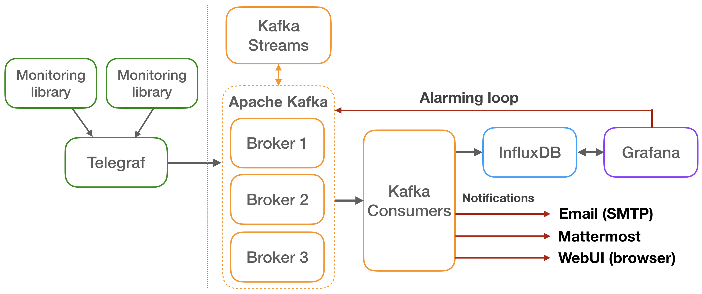

# Monitoring system implementation based on Modular Stack

## 1. Goal and requirements

The main goal of the monitoring system is to supply an easy-to-use, customisable and complete user-interface capable to provide all needed information related to the state of O2 Facility. Graphical interfaces and an alarming service are been selected to satisfy this requirement. Both near-real-time and historical monitoring data are considered important to cover all performance aspects and by means of evaluate all facility components' state. On the other hand, only collecting fully comprehensive information data the monitoring system is able to accomplish its goal. Three monitoring data types has been selected: applications, processes and systems information. These components send periodically monitoring data to both near-real-time and historical dashboards. In the near-real-time dashboard the information must be displayed as soon as possible in order to allow experts to be reactive to abnormal situations, so a low latency transport layer is mandatory. Whereas, the historical dashboard does not require a high resolution monitoring data, since its goal is more related to statistical, debugging and accounting purposes. Data aggregation and other processing tasks like suppression, enrichment and correlation tasks, must be provided from a processing component. Historical data must be stored in a dedicated component from which the historical dashboard retrieves the information to display. The selected database must be support large input metric rates, low storage size and down-sampling. Dashboards must display time series data using plots, gauges, bar, and other graphical objects. The near-real-time dashboard must plot low latency status information, useful for shift crews and providing a summary view of the ongoing ALICE operations. Whereas the historical one must display data stored in the storage component, useful for experts and allowing for drill down and detailed views. These dashboards must be accessed from different operating systems and from outside of the ALICE Point 2. The alarming component must support experts by detecting abnormal situations both in historical or near-real-time scenario. Figure 1 shows the functional architecture of the system, where the metric collection, processing, storage, visualisation and alarming components are been highlighted.

<br>
*Figure 1. Monitoring architecture*<br>

Below, the list of requirements regarding the monitoring subsystem has been established from the information available in the O2 Technical Design Report [2]:
 - Compatible with the O2 reference operating system (currently CERN CentOS 7).
 - Well documented.
 - Actively maintained and supported by developers.
 - Run in isolation when external services and/or connection to outside of ALICE are not available.
 - Capable of handling 600 kHz input metric rate.
 - Scalable to >> 600 kHz if necessary.
 - Handle at least 100 000 sources.
 - Introduce latency no higher than 500 ms up to the processing layer, and 1000 ms to the visualisation layer.
 - Impose low storage size per measurement.
 - Aligned with functional architecture:
   - Sensors.
   - Metric processing.
   - Historical record and near-real-time visualisation.
   - Alarming.
   - Storage that supports down-sampling, large input metric rates and low storage size.


In addition, some optional requirements may positively influence the final rating:
-	Supported by CERN or used in one of the experiments/departments.
-	Self-recovery in case of connectivity issues.

## 2. The Modular Stack
The Modular Stack solution aims at fulfilling the requirements specified in the above section by using multiple and replaceable tools. Such approach enables the possibility of replacing one or more of the selected components in case alternative options provide improved performance or additional functionalities. Moreover, opting for open source tools supported by developers ensures reliability, performance improvement. The provided documentation took was a important feature during the tool selection. For all the softwares external resources like website documentations, mailing lists (Google Groups), Github, books and tutorial are available to accelerating the learning curve and simplifying the project handover. Moreover, all the selected tools are compatible with the most important Linux distributions, including CERN CentOS 7.
The Modular Stack requires maintaining multiple tools and therefore compatibility between them. This results in higher system complexity and necessity to acquire knowledge on all the components. In case one of the selected tools breaks backward compatibility, becomes obsolete or its maintenance or support is dropped, the system might need to be adjusted or even redesigned. On the other hand, only standardised protocols are used for the communication which can facilitate any future migration. There is also the possibility that newly introduced features will require the purchasing of a subscription or license.
Following an overview of the chosen tools. More details of each components will be described in the next sections.
The monitoring system collects three different types of monitoring data: application, process and system information. The first two are covered from a O2 monitoring library, whereas the third is provided using an external tool. CollectD[XXX] was selected for retrieving system metrics (related to CPU, memory and I/O) from all hosts belonging to the O2 Facility. The high monitoring data rate requires a transport layer capable to manage and route all collected data. Apache Flume[XX], "a distributed and highly-reliable service for collecting, aggregating and moving large amounts of data in a very efficient way. ", has been selected. Moreover, it could execute also simple processing tasks. As storing component InfluxDB[XXX], "a custom high-performance data store written specifically for time series data", fulfils all the above requirements. Grafana[XX] is selected as graphical interface to display time series data for near-real-time and historical prospectives. Riemann[XXX] provides useful ways to forward externally alarms using multiple plugins and allows to implement some processing tasks internally. All remaining more complex processing tasks are implemented through Apache Spark[XXX], "a fast and general-purpose engine for large-scale data processing". The figure 2 shows the actual architecture of Modular Stack with all the components enunciated.

<br>
*Figure 2. Modular Stack architecture*<br>

### 2.1 Sensors
The O2 Monitoring subsystem collects three classes of metrics:
- Application.
- Process.
- System (and infrastructure).
All these metrics are pushed to the backend for the processing, aggregation and storage.

#### 2.1.1 Collectd - system metrics
| Plugin    | Metric description | Requirements | Comments |
| --------- | ------------------ | ------------ | -------- |
| CPU       | Amount of time spent by the CPU in various states (user, system, io, idle, irq) | `/proc` | Jiffie unit |
| Interface | Throughput, packets/second and errors/second per interface | `/proc` | List of interfaces can be defined |
| Memory    | Memory utilisation (Used, Buffered, Cached, Free) | `/proc` | - |
| DF        | Used and available disk space per mounted partition | `statfs`, `getmntent` | List of partitions can be defined |
| Load      | System load as 1, 5, 15 minutes average | `/proc` | - |
| Uptime    | Execution time; current, average and maximum | `/proc` | - |
| Disk      | Disk performance metrics per read and write: average time, operation per second, io time and more | `/proc/diskstats` | - |
| Logfile   | Internal; writes collectd logs into a file | - | - |

Data from collectd can be transferred by one of two plugins (the selection is done in the Ansible recipe)
 - Network - binary protocol over UDP, natively supported by InfluxDB
 - Write HTTP - Formats data JSON and send over HTTP, Supported by Flume JSON Collectd HTTP Handler

#### 2.1.2 Process related metrics
| Metric    | Metric description | Requirements |
| --------- | ------------------ | ------------ |
| Bytes received and transmitted | Number of bytes received and transmitted by the process (per interface) | `/proc` |
| pmem | CPU usage | `ps` |
| pcpu | Memory usage | `ps` |

#### 2.1.3 Application specific metrics
The Application metric collection provides an entry point from O2 processes to the Monitoring subsystem. It forwards user defined metrics to the processing backend via connection or connection-less transport protocols.

### 2.2 Transport Layer
The large amount of monitoring data generated from the O2 Facility requires a high-performance transport layer. The main goal of this component is to receive monitoring data from the sensors installed on every host in the O2 Facility and route them towards the historical storage(InfluxDB), near-real-time dashboard(Grafana ), Alarming component(Riemann) and computing unit(Apache Spark), as shown in Figure 2. Routing capability allows to send incoming data from the same data source towards different consumers. Apache Flume has been selected to fulfil the transport layer requirements. It is defined a "distributed, reliable, and available system for efficiently collecting, aggregating and moving large amounts of log data from many different sources to a centralised data store". Moreover, it "can be used to transport massive quantities of event data including but not limited to network traffic data, social-media-generated data, email messages and pretty much any data source possible". The Flume data flow model depends on:
"	the Flume event, defined "as a unit of data flow having a byte payload and an optional set of string attributes".
"	the Flume agent, a "process that hosts the components through which events flow from an external source to the next destination (hop)".

<br>
*Figure 3. Flume agent*<br>

"The external source sends events to Flume in a format that is recognised by the target Flume source. When a Flume source receives an event, it stores it into one or more channels. The channel is a passive store that keeps the event until it's consumed by a Flume sink. Channels could be store events in memory (for fast transmissions) or on local file system (for reliable transmissions). The sink removes the event from the channel and puts it into an external repository, like HDFS, or forwards it to the Flume source of the next Flume agent (next hop) in the flow. The source and sink within the given agent run asynchronously with the events staged in the channel".
An advantage to use Apache Flume is its high compatibility with other components belonging to the Hadoop ecosystem, like Apache Spark, providing natively components to receive and transmit data from and to the most important Hadoop components (HDFS, Apache HBase, Apache Hive, Apache Kafka, …. ). Unfortunately, Flume components able to read from and write to the selected tools are not provided. Custom components are been developed except for Apache Spark.
Beyond these three components, Flume provide also:
"	Interceptor: component ables to modify/drop event in-flight.
"	Channel selector: component ables to define to which channel forward the Flume event, depending on an attribute value.
These two components are related to a specific source and act after that and before the event is added to a channel.
Flume has some system requirements:
- Java Runtime Environment (Java 1.8 or later)
- Memory - Sufficient memory for configurations used by sources, channels or sinks
- Disk Space - Sufficient disk space for configurations used by channels or sinks
- Directory Permissions - Read/Write permissions for directories used by agent

Running a Flume Agent is very simple. You need to follow these steps:
- Download the tar.gz archive from the Flume web site, corresponding to the desired version.
- Set the Java environment variable JAVA_HOME.
- Configure the agent by writing a properties file.
- Run Flume agent.
For Example. It we want to run a flume agent capable to collect the HTTP packet and write down the body in a file, the following steps must be done:
```bash
wget  mirror.switch.ch/mirror/apache/dist/flume/1.8.0/apache-flume-1.8.0-bin.tar.gz
tar -xzf ./apache-flume-1.8.0-bin.tar.gz
mv ./apache-flume-1.8.0-bin /home/centos7/flume
export FLUME_HOME=/home/centos7/flume
export JAVA_HOME=/usr (this directory could be change)
vim /home/centos7/flume/conf/example.properties
```

Then insert in the file `$FLUME_HOME/conf/example.properties` following configuration [link to GitHub config].

Then execute:
```bash
/bin/bash $FLUME_HOME/bin/flume-ng agent -n agent -c $FLUME_HOME/conf -f $FLUME_HOME/conf/example.properties -Dflume.root.logger=INFO,console
```

After that it's need to send HTTP packets at port 7777 in JSON format, like the following:
```JSON
[{"headers" : {
  "timestamp" : "434324343",
  "host" : "random_host.example.com"             },
  "body" : "random_body"
}, {"headers" : {
  "namenode" : "namenode.example.com",
  "datanode" : "random_datanode.example.com"
}, "body" : "really_random_body"
}]
```

The directory /var/log/flume there will be one or more files, depending on the rolling file settings, containing the line "random_body" and "really_random_body".
As shown in the Fig 2 the Flume agents receive data from Application and Process Sensors and CollectD and transmit events to InfluxDB, Grafana, Riemann and Apache Spark. One of requirements is the capability to manage a large amount of monitoring data. The memory channels have been selected to fulfill this requirement, since the reliability has less priority of throughput.
The Flume components need a custom implementation are:
- InfluxDB Sink
- Grafana Sink
- Riemann Sink
- Application and Process information Source
- Collectd Source
- Enrichment Interceptor

The Fig 4 shows with more details the inner architecture of Flume components.

<br>
*Figure 4. Flume inner architecture*<br>

The channel selectors allow the routing of metric towards specific sinks using an attribute value contained in the Flume event: a switch-case structure route the event towards one or multiple channels. Generally, not all the metrics belonging to a group (application, process or collectd information) will be sent all towards a specific channel but a subgroup of them. To manage this need, interceptors could be inserted after the source in order to add specific attribute values to specific event in order to allow a successful routing. There is no interceptor after the Spark Source, since the information enrichment could be done directly in the Spark tasks. Following will be discuss of every of component shown in the Figure 4.

#### 2.2.1 InfluxDB Sink

The InfluxDB Sink allows to send data using HTTP or TCP packets. Tests shown the TCP protocol provides better performances respect low latency and throughput. So a InfluxDB UDP Sink has been developed. Since Apache Flume uses a Java Virtual Machine, the code can be written both in Java or Scala. For Flume custom components the Java programming language has been selected. The InfluxDB UDP Sink developed takes from the channel the Flume event, convert it to the InfluxDB Line Protocol[XXX] and finally send the UDP packet to the hostname and port defined in the Flume agent configuration file (properties file).
The InfluxDB Line Protocol is a string containing:
"	Metric name.
"	Tags.
"	Values.
"	Timestamp (ns).
The tags and timestamp fields are optionals. The generic format is following shown:
"metric_name,tag1=key1,tag2=key2 value_name1=value1,value_name2=value2 timestamp_ns"

Value could have 4 types:
"	Long type is represented with a "i"-ending. Example: "number_process count=10i".
"	Double type is represented normally. Example: "perc_usage idle=0.98".
"	String type is represented inserting ' " '. Example: "generic_metric hostname=\"test-machine\""
"	Boolean type is presented with the key word "true" or "false". Example: "generic_metric ping=true"

In order to keep the Flume event as more generic as possible, the metric name, tags, values and timestamp information are put directly in the event header. The event body is left empty.
Key-words have been given to these fields:
"	"name" for the metric_name
"	"timestamp" for timestamp
"	"tag_" as prefix of tags. Example "tag_host" and "tag_type_instance"
"	"value_" as prefix of values. Example: "value_idle" and "value_hostid"

If other key-words are found from the sink, they won't be considered.
For Example, the Flume event:
```JSON
[{  "headers" : {       "timestamp" : "434324343",       "tag_host" : "cnaf0.infn.it",       "tag_cpu" : "1",       "tag_site" : "CNAF",
       "name" : "cpu",       "value_idle" : "0.93",
       "value_user" : "0.03"       },
  "body" : ""}]
```

produces the InfluxDB Line Protocol:
```
"cpy,host=cnaf0.infn.it,site=CNAF,cpu=1 idle=0.93,user=0.03 434324343"
```

#### 2.2.2 Grafana Sink

The NRT Grafana Sink has the goal to send data directly to the near-real-time Dashboard. Further details are not present since the component has not been developed yet.

#### 2.2.3 Riemann Sink

The Riemann Sink has the goal to send data to the Riemann instance in order to forwards message to expert.
Riemann accepts incoming data both in HTTP or TCP. Test or considerations will evaluate the best protocol to use.
Further details are not present since the component has not been developed yet.

#### 2.2.4 Spark Sink

The Spark Sink has the goal to send data to Spark in order to allow the execution of processing tasks. According the "Spark Streaming - Flume integration" page [https://spark.apache.org/docs/2.2.0/streaming-flume-integration.html] there are two approaches to send data: Push-based approach and Pull-base approach.
In the first approach, Spark Streaming acts like a Flume Avro Source, thus the Spark Sink is essentially an Avro Sink. The second one, the Spark Sink acts like a buffer while "Spark Streaming uses a reliable Flume receiver and transactions to pull data from the sink". Actually the first approach is used, further details will be present in the Spark section. In this scenario the Spark Sink is implemented with a native Flume Avro Sink.

#### 2.2.5 Application and Process Source

The Application and Process Source has the goal to receive the data sent from the Application and Process sensors. Since the sensors are a custom implementation (Monitoring Library) both HTTP and TCP approaches are available. However, tests showed TCP protocol has better performance. In order to have a unique and general event format for all the Flume components, each collected packet is converted one o multiple events, where all metric fields are inserted into the headers Flume event fields. The UDP Flume Source is able to decode multiple events within UDP packet containing a JSON string type data like following:
```JSON
[{  "headers" : {        "timestamp" : "434324343",        "tag_host" : "random_host.example.com",        "name" : "cpu",        "value_idle" : "0.13"        },  "body" : "random_body"  },  …]
```
The Body field is not decoded.

#### 2.2.6 CollectD Source

The CollectD Source has the goal to collect data coming from CollectD clients. HTTP protocol with "JSON format"[https://collectd.org/wiki/index.php/Plugin:Write_HTTP] is selected for simplicity and consistency, since within the JSON is provided the value names, value formats and value fields. Whereas the "command format" requires an external file containing this information. Even if the latter method uses less bytes per metric, it depends on collectd protocol version. So to be version independent, the JSON format has been selected.
Flume natively provides a HTTP Source but it is not able to decode the CollectD JSON format. Custom handlers could be used to decode the HTTP packet instead to use those Flume provides: JSON and Binary handlers. So only the CollectD JSON HTTP Handler has been implemented instead of the whole custom HTTP Source.
Following an example of a CollectD JSON format is shown:
```JSON
[   {     "values": [197141504, 175136768],     "dstypes": ["counter", "counter"],     "dsnames": ["read", "write"],     "time": 1251533299.265,     "interval": 10,     "host": "leeloo.lan.home.verplant.org",     "plugin": "disk",     "plugin_instance": "sda",     "type": "disk_octets",     "type_instance": ""   } ]
```

"Values", "dstypes" and "dsname" fields have a sorted list with the same number of elements. The "dstypes" fields defines the value type:
 - COUNTER or ABSOLUTE is an unsigned integer.
 - DERIVE(\*) is an signed integer.
 - GAUGE is a double.

The following actions are implemented in the Collectd JSON HTTP Handler:
- Java long type has been used for unsigned and signed integer.
- The time field is store in the "timestamp" Flume event field in nanoseconds and in long format.
- The interval field is not used.
- The name Flume event field is composed of plugin collectd JSON field and the the ith of dsnames field list e.g. "disk_read", "disk_write".
- The host, plugin_instance, type, type_instance fields are copied in the Flume event using the field prefix "tag_" e.g. "tag_host", "tag_plugin_instance".
- The type_value is added to the Flume event to insert the value type information and can assume only two values: "double" or "long" value.
- The value in put into the value_value Flume event.
- If one of the plugin_instance, type, type_instance fields is empty, that field is not inserted in the Flume event.

All data are in string format since stored in headers Flume Event field. The type_value field is considered optional.
Following the above actions, the CollectD JSON shown before produces the following Flume event.
```JSON
[{"headers" : {        "timestamp" : "1251533299265000000",        "tag_host" : "leeloo.lan.home.verplant.org",      "name" : "disk_read",        "value_value":  "197141504",        "type_value" : "long",
        "tag_plugin_instance": "sda",
        "tag_type": "disk_octets"        },  "body" : "" }, {"headers" : {        "timestamp" : "1251533299265000000",        "tag_host" : "leeloo.lan.home.verplant.org", "name" : "disk_write",        "value_value":  "175136768",        "type_value" : "long",
        "tag_plugin_instance": "sda",
        "tag_type": "disk_octets"             },  "body" : "" }]
```

#### 2.2.7 Spark Source
The Spark Source has the goal to receive the produced events from the Spark real-time processing tasks, so there is the freedom to select the best solution. Two approaches have been tested: using Avro events or UDP packets. They require an Avro Source and UDP Source, respectively. The implemented UDP Source could be used due its flexibility.

#### 2.2.8 Information Enrichment Interceptor
The information Enrichment Interceptor has the goal to add information to specific Flume events. Since the information is contained in the tags fields, this component adds specific tag-value couple to the event.

#### 2.2.9 Channel Selector
The (Multiplexing) Channel Selector allows to route events towards specific channel depending on a specific field value. It is a native Flume component so there is no need to develop a custom component but it's need only configuring the Flume agent. The channel selector acts after the source and the interceptor chain (multiple interceptors could be used in chain).
For example, the "target" field is used to route the events. It could assume "to_historical_storage", "to_nrt_dashboard" and "to_processing_unit" values. Event not containing this tag must be sent to the historical storage. Following only the channel selector section that implements this functionality is shown [add link to GitHub default config].

### 2.3 Storage
The goal of the historical storage is to store all the data the historical dashboards need. In this scenario could be useful downsampling the metric at the minimum sampling rate in order to reduce the disk usage.
InfluxDB is an open source database optimised for time series data and its features make it the best solution to accomplish the database requirements. The storing size per measurement is low and takes only three bytes for no-string values. Its engine inherently supports downsamplings and makes easy to create new downsampled metrics starting from a raw one or extract time-values with a desired resolution and aggregation function.
The storing size per measurement is low and takes only three bytes for no-string values.
Its engine inherently supports downsamplings and makes easy to create new downsampled metrics starting from a raw one or extract time-values with a desired resolution and aggregation function.
As a next step the metrics are pushed to an InfluxDB database which is optimised to store time series data points. It also provides high performing writing, "expressive SQL-like query language tailored to easily query -aggregated data" and low disk occupancy per measurement -three bytes for non-string values. The InfluxDB engine supports downsampling via Retention Policy and Continuous Queries. The combination of these two features requires only the time resolution and time period to be specified (e.g. store 1 data point per 30 seconds for data not older than 30 days).
Being the collected metrics classified as time series a database optimised to store this kind of data, InfluxDB[G3], has been chosen:it provides, in addition, low disk usage, high performing writing and expressive SQL-like query language tailored to easily query-aggregated data.

#### 2.3.1 Data organization
As relation databases, in influxDB the data are stored in a specific database, containing multiple measurements. A measurement could be associated to the relation database table. Different all data within a database belong to the same retention policy.

#### 2.3.2 Retention Policy

### 2.4 Dashboards
Historical and Near-real-time dashboard have the goal to plot the monitoring data using graphical object on a interface accessible on the web.
Grafana has been chosen as data visualisation tool. It offers customised historical record dashboards and real-time version is already foreseen in the roadmap. It can also generate alarms based on values coming from the database. Riemann is used as the main alarming tool. It inspects metrics on the fly and generates notifications when undesired behaviour is detected
It makes possible to create both real-time and historical interfaces, generate no real-time alarming and retrieve data from InfluxDB inherently.
It can also generate alarms based on values coming from the database.

#### 2.4.1 Grafana


### 2.5 Alarming
The alarming component has the goal to forward externally important alarm to experts. Riemann has been selected . It inspects metrics on the fly and generates notifications when undesired behaviour is detected. The selected tools work without the need for external services or internet connectivity.

### 2.6 Batch and streaming processing
Flume and Riemann (What about Spark?) could be used to accomplish few processing tasks (data suppression and data enrichment) while the remaining ones will be executed by the Elaboration unit. Apache Spark[G6], "a fast and general-purpose engine for large-scale data processing" has been selected to implement the task of this component.

## 3. Deployment

To allow quick deployment of the tools and ...
Ansible roles were prepared for the following components: [https://gitlab.cern.ch/AliceO2Group/system-configuration/tree/master/ansible]
 - Flume
 - Spark
 - collectd
 - InfluxDB
